# 🌐 SkillNexus — Learn, Teach, Earn

<p>
  
  
  
  
  
</p>

SkillNexus connects learners and teachers worldwide with transparent payments, group learning, and real-time messaging — built with an NPR-centric accounting pipeline for clarity and fairness.

<p>
  
</p>

## 💡 Why SkillNexus?
- Make learning accessible across countries and currencies
- Ensure platform fees are transparent (deducted from NPR)
- Automate teacher payouts in their local currency
- Support solo and group sessions with messaging

## ✨ Core Features
- Requests & Offers: learners post needs; teachers post offers
- Acceptance Flow: teachers accept requests; learners accept offers
- Group Sessions: invite friends; split payments equally or single payer
- Messaging: group chat opens after acceptance
- Wallet: track payments as learner and teacher
- Admin Console: manage currency rates, transactions, bank/QR details, payouts, complaints

## 🧱 Architecture
- Frontend: React 18, Vite 5, Tailwind, Router, Axios
- Backend: Node.js, Express, MongoDB/Mongoose, JWT, Cloudinary uploads
- Currency: buy/sell to USD rates; country→currency mapping in PlatformConfig

## 💱 Currency Pipeline (NPR-Centric)
1) Offer currency → USD using buy rate
2) USD → NPR using sell rate
3) Deduct platform fee from NPR
4) NPR → teacher currency using buy(NPR)/sell(teacher)

<p>
  
</p>

Stored on Transaction:
- amountPaid (payer currency)
- amountPaidNPR
- platformFeeAmountNPR
- teacherAmountNPR
- nprToPayoutRate
- payoutAmount

Admin payout:
- Defaults to teacherAmountNPR × [buy(NPR)/sell(payout)]
- Fee override recalculates NPR fee and net NPR

## 🛠️ Getting Started
Prereqs:
- Node.js 18+
- MongoDB (Atlas or local)
- Cloudinary account

Setup:
```bash
# Backend
cd backend
npm install
copy .env.example to .env  # create your env with secrets
npm run dev

# Frontend (in another terminal)
cd frontend
npm install
npm run dev
```

🔗 Frontend: http://localhost:5173/  
🔗 Backend: http://localhost:5000/

Proxy:
- Vite proxies /api to backend
- Set VITE_API_PORT if backend is not 5000

## 🔐 Environment (Backend)
```
MONGODB_URI=mongodb+srv://...
JWT_SECRET=your-secure-secret
ADMIN_EMAIL=admin@skillnexus.com
ADMIN_PASSWORD=change-this
ADMIN_NAME=Platform Admin
CLOUD_NAME=your-cloudinary-name
CLOUD_API_KEY=your-cloudinary-key
CLOUD_API_SECRET=your-cloudinary-secret
PORT=5000
```

## 🧭 Workflows
- Learner pays → amount converts to NPR → platform fee deducted → teacher net NPR auto-converts to their currency
- Group equal split → per-member shares; dashboard indicates unpaid participants; reminders available
- Admin marks payout → rate defaults to buy(NPR)/sell(teacher); history tracked

## 📚 Useful Paths
- Frontend: frontend/src/pages (Dashboard, TeachOffers, RequestBoard, GroupChat, Admin)
- Backend Routes: /api/auth, /api/sessions, /api/group-chats, /api/transactions, /api/admin, /api/platform, /api/upload, /api/complaints, /api/notifications, /api/reviews

## 🧪 Tips
- Configure buy/sell rates and country→currency mapping in Admin → Platform
- Upload QR/bank details for payouts
- Keep secrets out of source control (use .env)

## 👤 Owner · Contact
**Sushil Panthi**

<p>
  <a href="tel:+919359029905"></a>
  <a href="https://wa.me/9779823009467"></a>
  <a href="https://www.linkedin.com/in/sushilpanthi/"></a>
  <a href="https://github.com/npanthi718"></a>
  <a href="https://www.sushilpanthi.com/"></a>
</p>

---

## 🗂️ Monorepo Layout
```
SkillNexus/
├─ frontend/   # React + Vite app (UI)
├─ backend/    # Node.js + Express API
└─ README.md   # This guide
```

## 🖼️ Design & Diagrams
<p>
  
</p>
<p>
  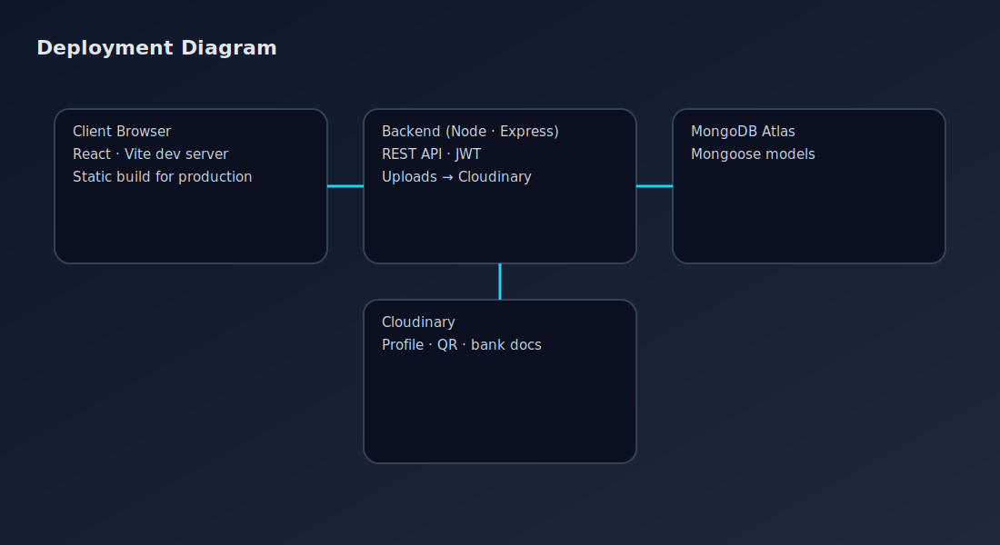
</p>
<p>
  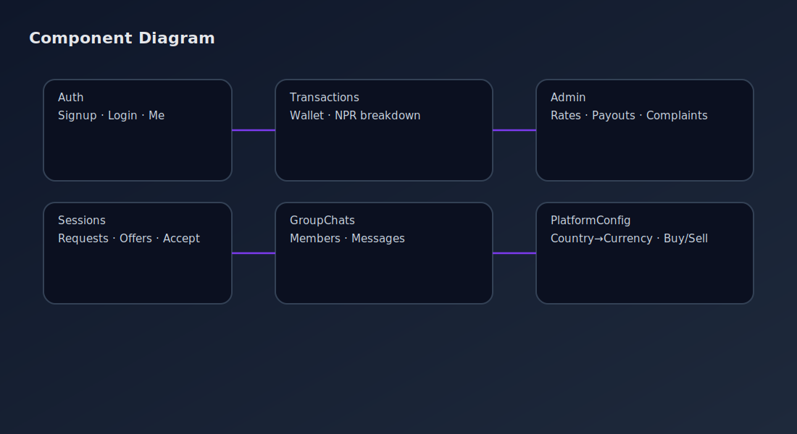
</p>
<p>
  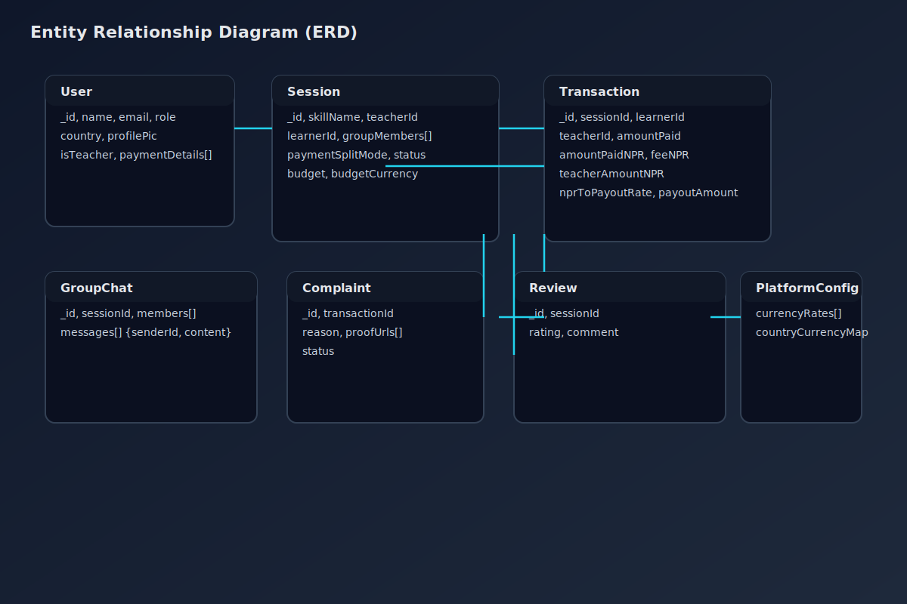
</p>
<p>
  
</p>
<p>
  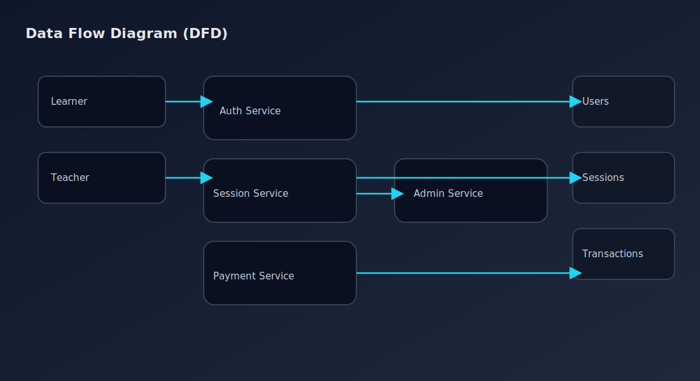
</p>
<p>
  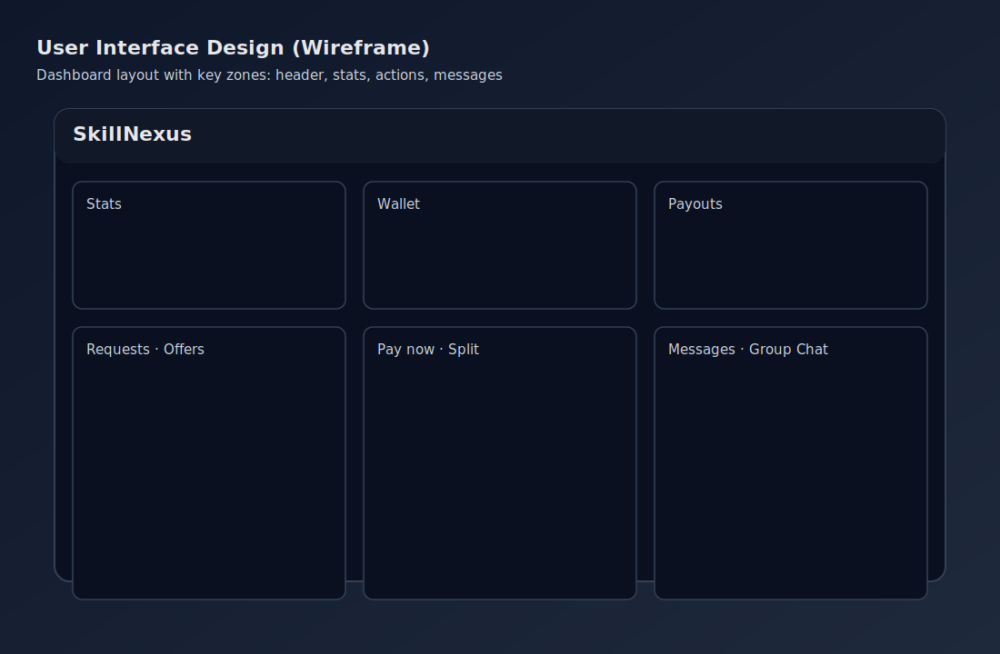
</p>
<p>
  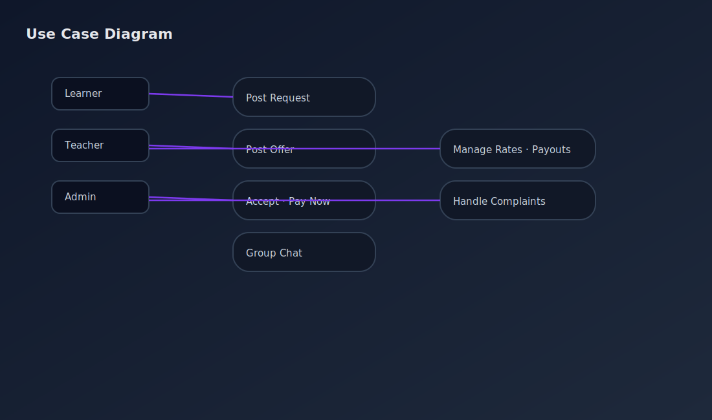
</p>
<p>
  
</p>

## 🖼️ Screenshots (High-Fidelity SVGs)
<p>
  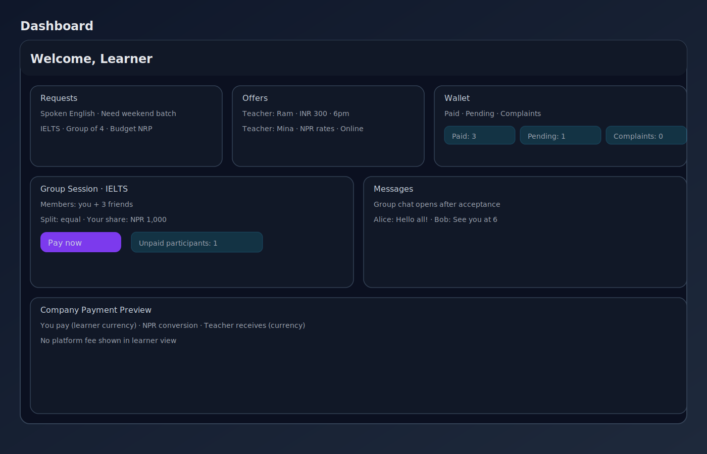
</p>
<p>
  
</p>
<p>
  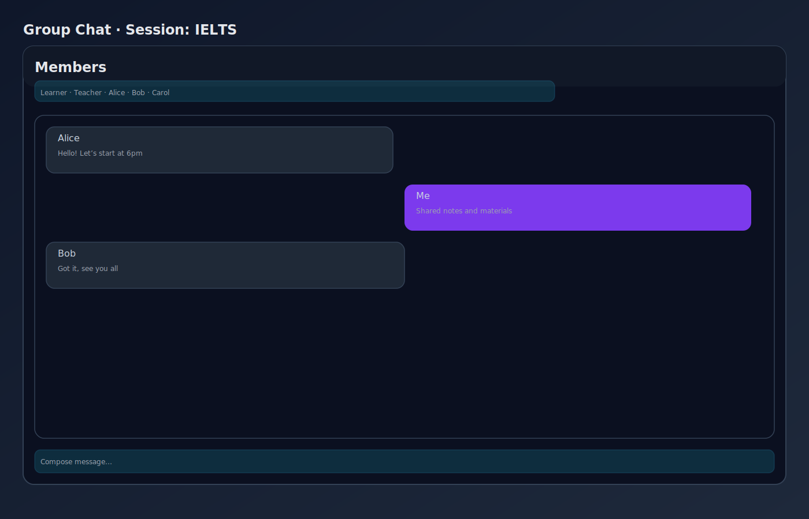
</p>
<p>
  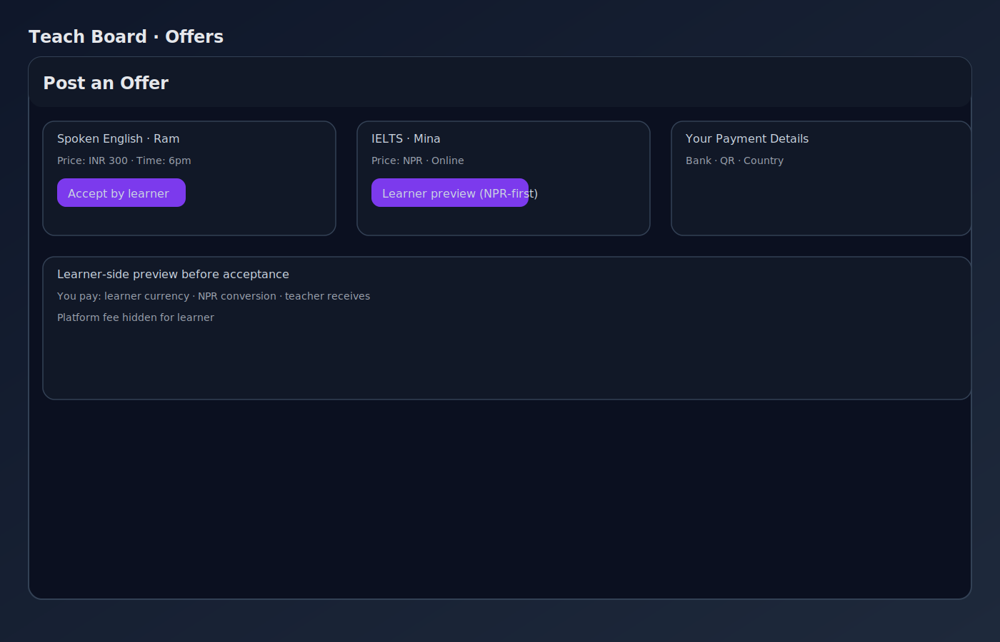
</p>
<p>
  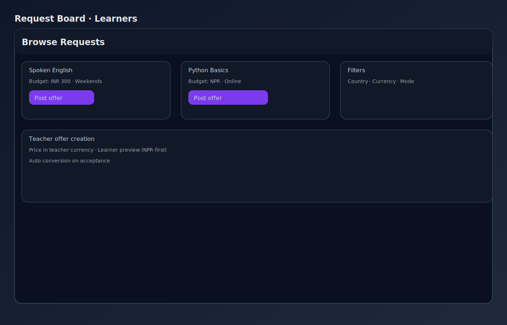
</p>
<p>
  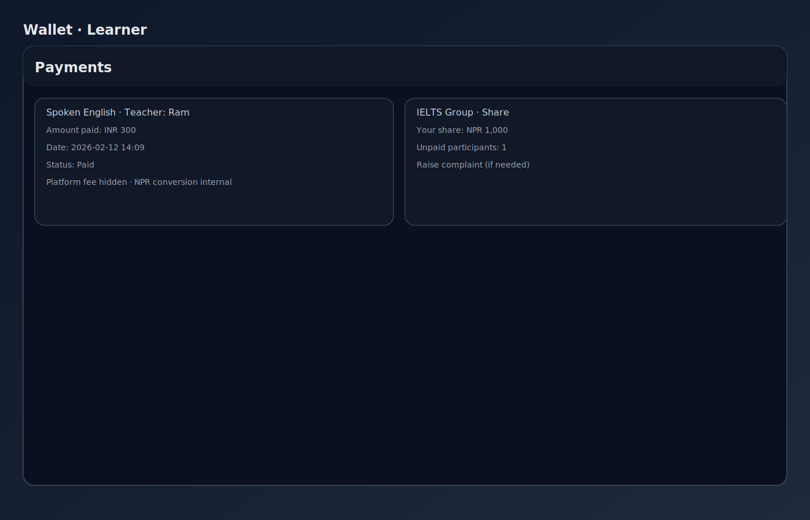
</p>
<p>
  
</p>

## 🔧 Deployment Config
- Frontend base API: set VITE_API_BASE to your live backend URL prefix (e.g., https://api.example.com or /api).
- Backend CORS origin: set FRONTEND_ORIGIN to the live frontend origin(s), comma-separated if multiple.
- Changing these values updates all API calls and CORS in one place.

## ⚡ Quick Start (60s)
```bash
# 1) Backend
cd backend
npm install
copy .env.example .env   # fill secrets
npm run dev              # http://localhost:5000

# 2) Frontend (new terminal)
cd frontend
npm install
npm run dev              # http://localhost:5173
```

Tips:
- Frontend proxies /api to backend; set VITE_API_PORT if backend port differs from 5000
- Default admin credentials from .env; change them in production

## 🔧 Configure Platform
- Admin → Platform:
  - Set buy/sell rates to USD (per currency)
  - Map countries to default currency codes
  - Add payout details (bank info, QR codes)

## 📈 NPR-First Accounting · Example
Scenario: INR 300 session, platform fee 10%
```
1) Offer: 300 INR → USD → NPR
2) Received NPR: e.g., 400 NPR (example after conversion)
3) Platform fee: 10% of Received NPR → 40 NPR
4) Net NPR to teacher: 400 - 40 = 360 NPR
5) Payout: 360 NPR × (NPR→teacher currency rate) = teacher payout
```
Transaction fields:
- amountPaid (payer currency)
- amountPaidNPR
- platformFeeAmountNPR
- teacherAmountNPR
- nprToPayoutRate
- payoutAmount

## 🔒 Security & Privacy
- JWT auth with secure secret
- No secrets in source control; use .env
- Media uploads via Cloudinary with scoped keys

## ✅ CI & Quality Gates
- GitHub Actions runs on every push/PR:
  - Frontend lint, tests, and production build
  - Backend dependencies install (ensures health of API project)
- Workflow: .github/workflows/ci.yml
- Local commands:
  - Frontend: npm run lint · npm run test · npm run build

## ⚙️ Environment Files
- Backend: copy backend/.env.example → backend/.env and fill secrets
- Frontend: copy frontend/.env.example → frontend/.env
- frontend/.env stays ignored; commit-safe values are provided via .env.example
- Do not commit secrets. Frontend uses VITE_* variables suitable for public configs.

## 🛡️ Resilience & Scale
- Input validation on admin expenditures API: amount ≥ 0, URL checks, length limits
- Client-side toasts show errors/success for fee updates and expenditures
- Pagination and sorting used for admin lists; add DB indexes as data grows
- Horizontal scalability: run multiple backend instances behind a reverse proxy; use MongoDB Atlas
- Add rate limiting and caching at the API gateway/CDN layer for peak (“lakhs” users) traffic

## 🧑‍💻 Developer Notes
- Frontend: React 18, Vite 5, Tailwind, Router, Axios
- Backend: Express, Mongoose, Multer, Cloudinary
- Code style: modern ES modules
- Group chat is enabled post-acceptance for group sessions

<p>
  
</p>
