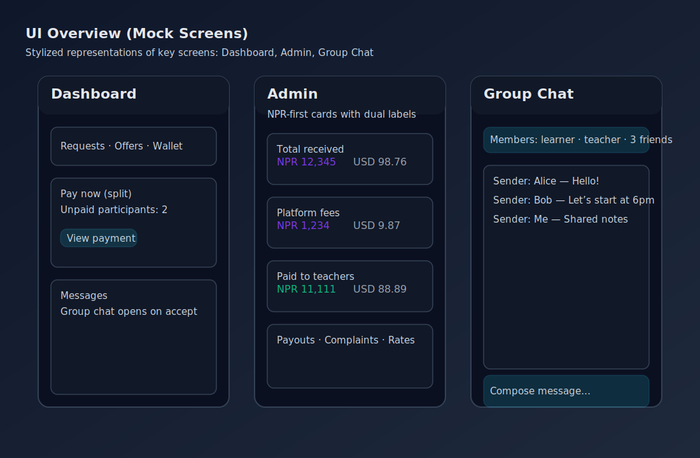

# 🎯 SkillNexus Frontend

<p>
  
  
  
  
  
</p>

Modern React frontend for SkillNexus — a learning marketplace connecting learners and teachers with transparent multi-currency payments, group sessions, and rich messaging.

<p>
  
</p>

## 🚀 Stack
- React 18 + Vite 5
- TailwindCSS 3
- React Router 6
- Axios for API calls
- Framer Motion (animations)

## 📂 Key Screens
- Dashboard: personal hub, requests, offers, wallet, messages
- Request Board: browse learners’ requests
- Teach Board: teachers post offers; learner-side payment preview
- Group Chat: session-based group messaging (after acceptance)
- Wallet: payments as learner and teacher
- Admin: rates, transactions, payouts, bank/QR details

## 🔄 Currency Preview (UI)
- Learner-side preview before accepting a teacher offer (Teach Board and Dashboard)
- Shows:
  - You pay: learner currency
  - Platform fee: NPR
  - Net in NPR
  - Teacher receives: teacher currency
- Pipeline: offer currency → USD → NPR (fee) → teacher currency

## 🧭 Dev Setup
1) Node.js 18+ installed
2) Backend running (default 5000)
3) Install and start:

```bash
npm install
npm run dev
```

🔗 Vite dev: http://localhost:5173/

Proxy to backend:
- Configured in vite.config.js
- Set VITE_API_PORT in your environment if backend port is not 5000

```bash
# Example
$env:VITE_API_PORT=5000   # PowerShell
```

## 🧱 Build & Preview
```bash
npm run build
npm run preview
```

## 🗺️ Notable Files
- src/pages/DashboardPage.jsx
- src/pages/RequestBoardPage.jsx
- src/pages/TeachOffersPage.jsx
- src/pages/GroupChatPage.jsx
- src/pages/AdminPage.jsx
- src/contexts/ThemeContext.jsx
- src/components/Toast.jsx
- src/utils/currency.js

## ✅ UX Notes
- Group chat becomes available only after a session is accepted
- “Pay now” shows per group split and payment status
- Admin modal shows NPR-centric conversion and teacher payout

---

## 🧭 Getting Started (UI)
```bash
npm install
npm run dev    # http://localhost:5173
```

Configure backend proxy:
```bash
# PowerShell
$env:VITE_API_PORT=5000
```

## 🧱 Build & Preview
```bash
npm run build
npm run preview
```

## 🎨 Design Principles
- Clean, glassmorphism-inspired UI
- Clear currency labels (NPR-first) with dual display on admin cards
- Minimal friction for “Pay now” and wallet review
- Accessible components and responsive layout

## 🔎 Notable Paths
- src/pages/DashboardPage.jsx
- src/pages/RequestBoardPage.jsx
- src/pages/TeachOffersPage.jsx
- src/pages/GroupChatPage.jsx
- src/pages/AdminPage.jsx
- src/utils/currency.js

## 👤 Owner · Contact
**Sushil Panthi**

<p>
  <a href="tel:+919359029905"></a>
  <a href="https://wa.me/9779823009467"></a>
  <a href="https://www.linkedin.com/in/sushilpanthi/"></a>
  <a href="https://github.com/npanthi718"></a>
  <a href="https://www.sushilpanthi.com/"></a>
</p>

